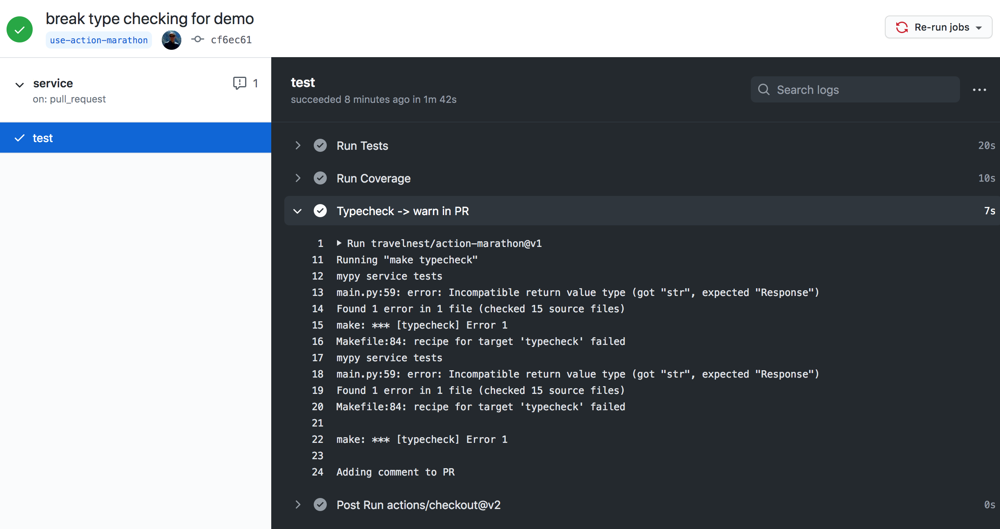
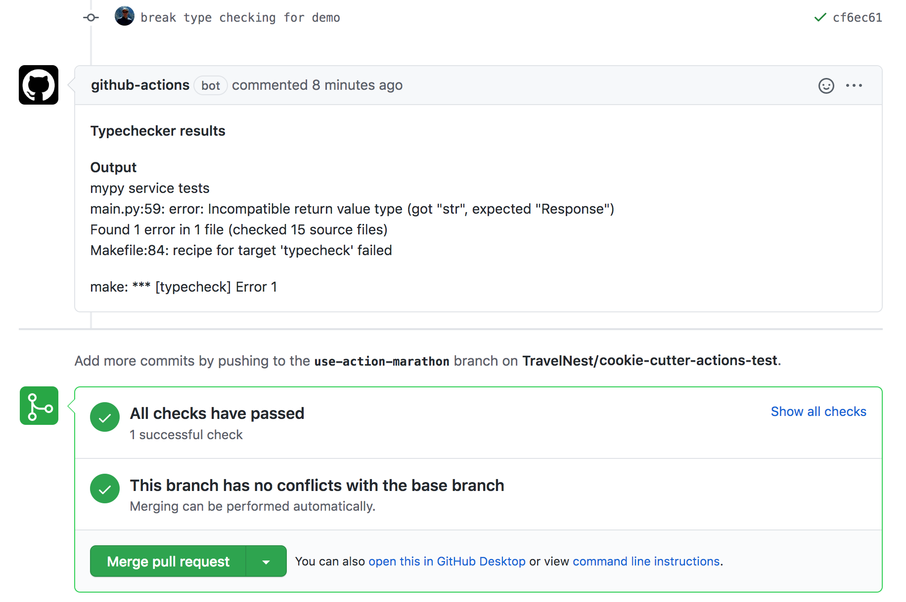

# Marathon – Comment Action

Marathon runs your task and comments about it on your Pull Request using GitHub Actions

## Usage

For example if you want to run a make target named `typecheck`
and, on failure, add its output as a PR comment;

add the following to your workflow yaml.

```yaml
- uses: travelnest/action-marathon@v1
  env:
    GITHUB_TOKEN: ${{ secrets.GITHUB_TOKEN }}
  with:
    command: make typecheck
    mode: failure
    text: "**Typechecker results**"
```

it will produce this in GitHub Actions console



and the comment on your PR will look like this


